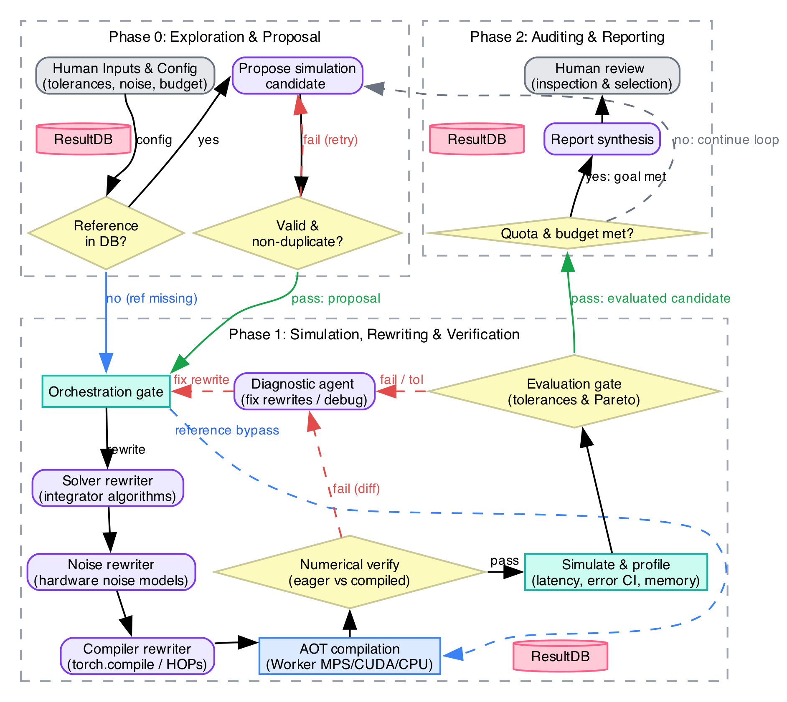

# Agentic Hardware/Software Co-Design Loop for Analog ML Accelerator Simulation

An autonomous agentic AI framework powered by [Chia](https://github.com/ucb-bar/chia) for co-designing and evaluating analog machine learning accelerators executing physical neural network models (continuous-time oscillatory neural networks and physical hardware dynamics based on the Un-0 modular baseline).
---

## Table of Contents

- [Overview](#overview)
- [Agentic Loop Architecture (Phases 0 – 2)](#agentic-loop-architecture-phases-0--2)
  - [Phase 0: Candidate Exploration & Gatekeeping](#phase-0-candidate-exploration--gatekeeping)
  - [Phase 1: Code Rewriting, Simulation & Verification](#phase-1-code-rewriting-simulation--verification)
  - [Phase 2: Experiment Auditing, Reporting & Consultation](#phase-2-experiment-auditing-reporting--consultation)
- [Configuration Guide: `simulation_config.yaml`](#configuration-guide-simulation_configyaml)
  - [Reference Design (`reference_design`)](#reference-design-reference_design)
  - [Solvers & Discretization Steps (`solvers`)](#solvers--discretization-steps-solvers)
  - [Hardware Noise Models (`noise_models`)](#hardware-noise-models-noise_models)
  - [Coupling Matrix Sparsity (`sparsity_configs`)](#coupling-matrix-sparsity-sparsity_configs)
  - [Numerical Tolerances (`tolerances`)](#numerical-tolerances-tolerances)
  - [Campaign Budget vs. Internal Counter Limits](#campaign-budget-vs-internal-counter-limits)
  - [Agent Model & Effort Allocation (`agent_efforts`)](#agent-model--effort-allocation-agent_efforts)
- [Un-0 Co-Design Engine Integration](#un-0-co-design-engine-integration)
- [Token & Resource Auditing](#token--resource-auditing)
- [Cluster Execution Architecture](#cluster-execution-architecture)
  - [Bare-Metal Native macOS (Apple Silicon)](#bare-metal-native-macos-apple-silicon)
  - [Cloud Burst Profile (GCP + Tailnet)](#cloud-burst-profile-gcp--tailnet)
- [Installation & Quickstart](#installation--quickstart)
- [Running the Loop](#running-the-loop)
- [Testing](#testing)

---

## Overview

Deploying neural networks directly onto analog silicon substrates enables ultra-low-latency and high-energy-efficiency inference by leveraging intrinsic circuit physics (e.g., Kuramoto oscillator phase locking, analog substrate state dynamics). However, analog hardware introduces non-idealities such as device mismatch, thermal noise, phase jitter, non-linear I-V characteristics, and line resistance.

This repository implements an autonomous **agentic hardware/software co-design loop** that searches the multi-objective Pareto frontier balancing **simulation speed and computational intensity** against **physical approximation fidelity and model accuracy** across two primary dimensions:
1. **Numerical Solver Discretization & Computational Intensity**: Balancing numerical solver complexity and step granularity (from low-order, fast approximations like `euler` to high-order and parallel solvers like `rk4`, `parareal`, `par_ode` across variable step counts $dt = T / N$) against simulation execution speed, memory footprint, and integration error.
2. **Physical Hardware Approximation & Noise Fidelity**: Simulating silicon non-idealities across multi-fidelity noise tiers to balance physical modeling realism against simulation evaluation cost.

---

## Agentic Loop Architecture (Phases 0 – 2)

The autonomous loop is organized into three synchronized phases governed by SQLite telemetry and standardized agentic and programmatic nodes:




### Phase 0: Candidate Exploration & Gatekeeping
- **User-Provided Configuration & Space Definition**: Governed by the  configuration file (`simulation_config.yaml`), which specifies high-level user requirements, candidate solvers, and physical noise models in natural language. These definitions are coupled with the specialized agentic tool, enabling LLM agents in Phase 1 to convert equations,  papers, and theoretical formulations into PyTorch-compilable and hardware-accelerable code.
- **Deterministic Noise Quota Scheduling**: Programmatically schedules target noise models across `config.noise_models`, ensuring that `budget.max_experiments` proposals are executed for each configured noise model (regardless of whether individual candidate compilations/simulations succeed or fail). When all noise model quotas are satisfied, Phase 0 terminates with `TERMINATED_MAX_CYCLES`.
- **Node 1 (`node1_phase0_check_reference`)**: Checks SQLite database for the baseline golden reference design. If missing, routes reference parameters to Phase 1 to establish baseline accuracy and latency.
- **Node 2 (`node2_phase0_propose_candidate`)**: Configurable LLM agent (powered by the LLM backend configured in the Chia platform) queries past evaluations and Pareto frontier, proposing novel combinations of solver, steps, and sparsity ratio, strictly constrained to the scheduled `target_noise_model`.
- **Node 3 (`node3_phase0_validate_proposal`)**: Gatekeeper validating proposals against allowed solver steps, noise models, and sparsity ratios; enforces the scheduled `target_noise_model` (rejecting mismatches with `REJECTED_WRONG_NOISE_MODEL`) and checks uniqueness against duplicate proposals.

### Phase 1: Code Rewriting, Simulation & Verification
- **Node 0 (`node0_phase1_gate`)**: Enforces debug mode isolation invariants and guards against invalid debug requests.
- **Nodes 1–3 (`node1_phase1_solver_rewriter`, `node2_phase1_noise_rewriter`, `node3_phase1_compiler_rewriter`)**: LLM agentic rewriter nodes responsible for converting the user-defined exploration space, reference papers, and mathematical theory into concrete, executable code implementations. They rewrite solver numerical integration routines, implement physical noise models, and construct dynamic PyTorch compiler definitions.
- **Node 4 (`node4_phase1_compilation_runner`)**: Programmatically compiles the model using the TorchInductor AOT compiler.
- **Node 5 (`node5_phase1_verify_correctness`)**: Verifies numerical stability and outputs between compiled and eager models against tolerances.
- **Node 6 (`node6_phase1_simulate_profile`)**: Executes batch inference simulation on hardware (Metal/MPS, CUDA, or CPU), profiling latency and relative error.
- **Node 7 (`node7_phase1_evaluation_gate`)**: Checks relative error degradation against `tolerances.solver_accuracy`. Marks successful designs `COMPLETED` and updates the Pareto frontier.
- **Node 8 (`node8_phase1_diagnostic_proposal`)**: Formulates targeted corrective rewrites or requests isolated Debug Mode when candidates fail.
- **Node 9 (`node9_phase1_error_handler`)**: Standardized stop handler executed when any retry counter is exhausted. Performs graceful termination, updates proposal status to `FAILED`, and generates an atomic SQLite live snapshot (`snapshots/<candidate_id>_error_snapshot.db`).

### Phase 2: Experiment Auditing, Reporting & Consultation
- **Node 1 (`node1_phase2_check_experiment_limit`)**: Checks completed experiment counts against `budget.max_experiments` and loop iterations against `budget.max_iterations`.
- **Node 2 (`node2_phase2_generate_final_report`)**: Compiles Pareto frontier plots, generates a LaTeX report with candidate comparison tables and token consumption, and compiles the final PDF artifact.
- **Interactive Consultant (TODO)**: A planned CLI REPL (`InteractiveReportSession`) backed by an LLM to answer technical questions and analyze Pareto trade-offs from the generated report.

---

## Configuration Guide: `simulation_config.yaml`

All simulation parameters, campaign budgets, tolerances, and agent models are centralized in [`config/simulation_config.yaml`](config/simulation_config.yaml).

```yaml
experiment_name: "un0_kuramoto_analog_acceleration"

# 1. Baseline Reference Design
reference_design:
  name: "cifar10/n1024"
  family: "cifar10"
  n_oscillators: 1024
  n_conditional_oscillators: 8
  solver: "rk4"
  num_steps: 25
  integration_time: 1.0
  precision: "fp32"
  noise_model: "none"
  sparsity_ratio: 0.0

# 2. Solvers Exploration Grid
solvers:
  euler:
    steps: [1, 2, 5, 10]
  rk4:
    steps: [5, 10, 15, 25]
  euler_backward:
    steps: [2, 5, 10]
  parareal:
    steps: [10, 20]
  par_ode:
    steps: [10, 25]

# 3. Hardware Noise Models
noise_models:
  - "L0_static_mismatch"
  - "L1_stochastic_parameter_noise"
  - "L2_functional_interface"
  - "L3_correlated_drift"

# 4. Sparsity Configurations
sparsity_configs:
  dense:
    sparsity_ratio: 0.0
  threshold_pruned:
    allowed_sparsity_ratios: [0.2, 0.4, 0.6, 0.8]
  degree_bounded:
    max_degree: [64, 128, 256]

# 5. Numerical Tolerances
tolerances:
  compile_check:
    rtol: 1e-4
    atol: 1e-4
  solver_accuracy:
    rtol: 5e-2
    atol: 5e-2
    max_fid_degradation: 2.0

# 6. Campaign Budget
budget:
  max_experiments: 10
  max_iterations: 15
  max_node_retries: 3
  timeout_seconds_per_eval: 300

# 7. Internal Phase 1 Counter Limits
counter_limits:
  max_counter_1_compilation: 3
  max_counter_2_rewrite: 3
  max_counter_3_debug_gate: 3
  max_counter_4_debug_loop: 5

# 8. Agent Reasoning Effort
agent_efforts:
  node2_phase0_propose_candidate:
    model: "gemini-2.5-pro"
    effort: "high"
  node1_phase1_solver_rewriter:
    model: "gemini-2.5-pro"
    effort: "high"
  node2_phase1_noise_rewriter:
    model: "gemini-2.5-pro"
    effort: "high"
  node3_phase1_compiler_rewriter:
    model: "gemini-2.5-pro"
    effort: "high"
  node8_phase1_diagnostic_proposal:
    model: "gemini-2.5-flash"
    effort: "medium"
  node2_phase2_generate_final_report:
    model: "gemini-2.5-flash"
    effort: "medium"
```

### Reference Design (`reference_design`)

Configures the golden ground truth baseline against which candidate designs are benchmarked. Rather than being fixed, this design is fully user-configurable and typically represents a reference model simulated with high precision (e.g., small step size, high-order solver, dense unpruned connectivity, and noise-free execution). All candidate accuracy degradation, relative trajectory errors, and simulation speedup multipliers are measured relative to this baseline.

### Solvers & Discretization Steps (`solvers`)
Defines the numerical algorithms available to candidate proposals. For each solver, `steps` specifies the allowed integration step grid. The step size is computed as $\Delta t = \text{integration\_time} / \text{num\_steps}$. Lower steps reduce simulation and MAC operation counts at the expense of truncation error.

**Solver Caching & Dynamic Reuse**: Solvers generated and verified by the Phase 1 rewriter nodes are dynamically registered and cached. Once a solver passes numerical correctness verification, subsequent candidates proposing the same solver logic reuse the cached implementation without redundant re-generation.

### Hardware Noise Models (`noise_models`)

Defines the physical noise exploration space. This is a user-configurable set of noise models, theoretical descriptions, and reference papers. The core architecture offloads implementation tasks to the Phase 1 LLM rewriters, which translate mathematical equations and circuit non-ideality specifications directly into PyTorch-compilable code.

Example noise tiers include:
- **`L0_static_mismatch`**: Time-invariant spatial threshold variation across crossbar cells.
- **`L1_stochastic_parameter_noise`**: Dynamic thermal noise and white parameter fluctuations.
- **`L2_functional_interface`**: ADC/DAC quantization and driver line parasitics.
- **`L3_correlated_drift`**: Temperature drift and low-frequency $1/f$ phase noise.

**Noise Model Caching**: Like solvers, once a noise model implementation is generated and verified, it is cached in the model registry so that future proposals targeting that noise model reuse the existing verified implementation.

### Coupling Matrix Sparsity (`sparsity_configs`)
Governs analog crossbar array connectivity:
- **`dense`**: Unpruned matrix ($0\%$ sparsity).
- **`threshold_pruned`**: Explores pruned coupling weights ($|K_{ij}| < \tau$) at ratios `[0.2, 0.4, 0.6, 0.8]`.
- **`degree_bounded`**: Constrains oscillator fan-in degrees to `[64, 128, 256]`.

### Numerical Tolerances (`tolerances`)
- **`compile_check`**: Strict tolerance (`rtol=1e-4`, `atol=1e-4`) enforced when comparing compiled AOT model forward passes against the eager model.
- **`solver_accuracy`**: Simulation accuracy criteria:
  - `rtol = 0.05` ($5\%$ maximum relative state trajectory error vs. reference).
  - `max_fid_degradation = 2.0` (maximum permissible FID degradation).

### Campaign Budget vs. Internal Counter Limits
The configuration file separates macro campaign bounds from micro execution retry bounds:

| Section | Parameter | Governs | Destination Upon Exceedance |
| :--- | :--- | :--- | :--- |
| **`budget`** | `max_experiments` (10) | Maximum candidate experiment proposals executed per noise model (campaign total: N_noise x max_experiments regardless of candidate compilation/simulation success or failure) | Phase 2 Final Report Generation |
| **`budget`** | `max_iterations` (15) | Hard ceiling on outer exploration cycles | Phase 2 Final Report Generation |
| **`budget`** | `max_node_retries` (3) | Phase 0 candidate rejection retries | Halt Phase 0 (`MAX_CYCLES_EXCEEDED`) |
| **`counter_limits`** | `max_counter_1_compilation` (3) | Compilation / ODE numerical checks (Node 5) | `node9_phase1_error_handler` |
| **`counter_limits`** | `max_counter_2_rewrite` (3) | Out-of-tolerance candidate rewrites (Node 7) | `node9_phase1_error_handler` |
| **`counter_limits`** | `max_counter_3_debug_gate` (3) | Invalid debug mode requests (Node 0) | `node9_phase1_error_handler` |
| **`counter_limits`** | `max_counter_4_debug_loop` (5) | Debug isolation iterations (Node 7) | `node9_phase1_error_handler` |

### Agent Model & Effort Allocation (`agent_efforts`)
Configures the LLM backend model and reasoning effort tier for each agentic node via the Chia framework. An example of configuration is:
- **Proposer & Rewriters** (`node2_phase0`, `node1_phase1`, `node2_phase1`, `node3_phase1`): Configured with high reasoning effort (or frontier models) for complex architectural parameter selection, mathematical translation, and code rewriting.
- **Diagnostics & Reporting** (`node8_phase1`, `node2_phase2`): Configured with medium reasoning effort (or lightweight models) for fast root-cause analysis, gating checks, and report summarization.

---

## Un-0 Co-Design Model Integration

The physical analog model baseline is provided by the `Un-0` project, integrated as a **Git submodule** (`Un-0/`) and installed in editable mode:
- **Modular Solvers** (`un0/solver/`): Pluggable numerical ODE integrators registered in `SOLVER_REGISTRY`.
- **Multi-Fidelity Noise** (`un0/noise/`): Hardware noise models implementing the physical noise ladder.
- **AOT Compiler Integration** (`un0/compiler/`): Dynamic AOT model compilation via `compile_model(eager_model)`.
- **Dynamic Root Discovery**: [`resolve_un0_root()`](src/agentic_ml_analog_sim/tools/un0_context_tool.py) resolves submodule and sibling directory paths dynamically, avoiding hardcoded filesystem paths.

---

## Token & Resource Auditing

Every LLM invocation across all phases extracts usage metrics (`prompt_tokens`, `completion_tokens`, `total_tokens`, and `duration_seconds`).
1. **Persistent SQLite Telemetry**: Stored in the `token_usage` table in `ResultDatabase`.
2. **Ray Profiler Registration**: Attached to the Chia profiling system via `get_profiler().add_info()`.
3. **Report Audit Table**: Automatically tabulated and rendered into the final LaTeX and PDF report.

---

## Cluster Execution Architecture

### Bare-Metal
- **Profile**: [`cluster.yaml`](cluster.yaml) / [`cluster.bare.yaml`](cluster.bare.yaml)
- **Acceleration**: CUDA or MPS.
- **Ray Resources**: Tagged with `antigravity_creds: 1`, `metal_gpu: 1`, `sqlite_db: 1`, and `python_worker: 4`.

### Cloud Burst Profile (GCP + Tailnet)
- **Profile**: [`cluster.cloud.yaml`](cluster.cloud.yaml)
- **Runtime**: Hybrid local head + GCP Linux worker instances (`g2-standard-8` with NVIDIA L4 GPUs).
- **Networking**: Userspace Tailscale WireGuard mesh securing inter-node Ray gRPC traffic.

---

## Installation & Quickstart

### Prerequisites
- **Operating System**: Cross-platform (developed natively on macOS Apple Silicon `aarch64`, expected compatibility with Linux).
- **Compute Accelerators**: In principle, the co-design loop can be executed on any device with **CPU**, Apple Silicon **Metal (MPS)**, or NVIDIA GPU (**CUDA**).
- **Python**: Python 3.10+ (managed via Conda, Miniconda, or standard Python virtual environment).
- **Container Runtime (Cloud / Distributed Workers)**: Docker / Containerd is used when running containerized workers or bursting to cloud environments. In the cloud profile (e.g., Google Cloud Platform GPU instances), prebuilt Docker containers (`dockerfiles/Dockerfile.ray_worker`) provide an isolated, standardized Linux environment packaged with CUDA drivers, PyTorch, Ray worker daemons, and Un-0 dependencies without requiring manual host configuration.

### Setup
```bash
# 1. Clone repository with submodules
git clone --recurse-submodules https://github.com/rYm-A/agentic-ML-analog-sim
cd agentic-ML-analog-sim

# 2. Activate conda environment
conda activate chia_env

# 3. Install packages in editable mode
pip install -e .
pip install -e Un-0

```

### Environment Variables

Configure environment variables in your shell (e.g., `~/.zshrc` for macOS), cluster configuration files, or job launch profiles:

| Variable Name | Scope / Component | Description | Default / Fallback Behavior | Example |
| :--- | :--- | :--- | :--- | :--- |
| `REGENERATIVE_CORNN_ROOT` | Core Swarm / Tools (`CompilationInfoTool`) | Path to the local `RegenariveCoRNN` reference repository used for inspection (`read_regenerative_cornn_file`, `list_regenerative_cornn_files`, `search_regenerative_cornn`). | If unset or non-existent, logs a warning and gracefully bypasses reference inspection tools, continuing with static PyTorch compile guides. | `export REGENERATIVE_CORNN_ROOT="/path/to/RegenariveCoRNN"` |
| `UN0_ROOT` | Core Swarm / Tools (`un0_context_tool.py`, `node3`) | Path to the local `Un-0` submodule or repository root directory. | Dynamically checks sibling `../Un-0`, submodule `Un-0/`, then package root fallback. | `export UN0_ROOT="/path/to/Un-0"` |
| `UN0_REWRITES_DIR` | Phase 1 / Compiler Rewriter (`node3`) | Explicit path to the `Un-0` compiler rewrites directory for auto-discovering dynamically registered AOT HOP rewrites. | Discovered dynamically via `un0_dir / "un0" / "compiler" / "rewrites"` or `UN0_ROOT`. | `export UN0_REWRITES_DIR="/path/to/Un-0/un0/compiler/rewrites"` |
| `AGENTIC_SIM_RUN_REWRITES_DIR` | Phase 1 / Compiler Rewriter (`node3`) | Secondary path for discovering compiler rewrites across parallel agent execution directories. | Omitted if unset or non-existent. | `export AGENTIC_SIM_RUN_REWRITES_DIR="/path/to/agentic-ML-analog-sim-run/Un-0/un0/compiler/rewrites"` |
| `AGENTIC_SIM_SSH_KEY` | Phase 1 / Cluster Sync (`phase_1.py`) | Private SSH identity file used to sync dynamic rewrites and results database to remote Ray worker nodes. | Defaults to `~/.ssh/id_ed25519`. | `export AGENTIC_SIM_SSH_KEY="~/.ssh/id_ed25519"` |
| `AGENTIC_SIM_REMOTE_HOST` | Phase 1 / Cluster Sync (`phase_1.py`) | Public IP address or hostname of the remote Google Cloud VM for distributed compilation sync (also accepts alias `CLOUD_VM_IP`). | If unset, skips remote cluster rsync gracefully without error. | `export AGENTIC_SIM_REMOTE_HOST="34.70.x.x"` |
| `AGENTIC_SIM_REMOTE_USER` | Phase 1 / Cluster Sync (`phase_1.py`) | SSH username on the remote Google Cloud VM worker node. | Defaults to `$USER` or `"ray"`. | `export AGENTIC_SIM_REMOTE_USER="chia"` |
| `AGENTIC_SIM_REMOTE_WORKSPACE` | Phase 1 / Cluster Sync (`phase_1.py`) | Base workspace path on the remote Google Cloud worker node where the repository is synced. | Defaults to `~/agentic-ML-analog-sim_cloud_run`. | `export AGENTIC_SIM_REMOTE_WORKSPACE="~/agentic-ML-analog-sim_cloud_run"` |
| `grpc_proxy` | Ray / Networking Proxy | HTTP CONNECT proxy URL for Ray cluster gRPC control channels across Tailnet/VPN relays. | Auto-detected via local Chia relay at `127.0.0.1:13129`; bypassed if no relay is active. | `export grpc_proxy="http://127.0.0.1:13129"` |
| `RAY_grpc_enable_http_proxy` | Ray / Networking Proxy | Instructs Ray gRPC C-core channel layer to enable HTTP CONNECT proxy tunneling. | Automatically set to `"1"` by `run_loop.py` and `phase_1.py` when local Chia tailnet relay is active. | `export RAY_grpc_enable_http_proxy="1"` |
| `no_grpc_proxy` | Ray / Networking Proxy | Comma-separated list of hostnames or IP addresses excluded from gRPC proxy routing. | Preserves existing value and automatically appends local host IP, `127.0.0.1`, and `localhost`. | `export no_grpc_proxy="127.0.0.1,localhost"` |
| `THIS_MACHINE` | Cluster / Head Node (`cluster.*.yaml`) | Local network IP address or hostname of the cluster head node machine. | Required by `cluster.bare.yaml`, `cluster.yaml`, and `cluster.cloud.yaml`; cluster initialization fails if unset. | `export THIS_MACHINE="192.168.1.100"` |
| `USER` | Cluster / Authentication | SSH user account for node access and Docker container naming (`chia-sim-worker-${USER}`). | Defaults to current shell user (`$USER`). | `export USER="chia"` |
| `GCP_PROJECT` | Cloud Burst (`cluster.cloud.yaml`) | Google Cloud Platform project ID for provisioning GPU simulation workers in cloud burst pool. | Required when deploying cloud burst workers via `chia up cluster.cloud.yaml`. | `export GCP_PROJECT="project-bd43fccf-d505-4c80-a3c"` |
| `TS_AUTHKEY` | Cloud Burst (`cluster.cloud.yaml`) | Pre-authenticated Tailscale authentication key for joining cloud GPU nodes to private VPN mesh. | Required for cloud worker mesh interconnection when `tailnet.manage_all: true`. | `export TS_AUTHKEY="tskey-auth-..."` |
| `RAY_ENABLE_WINDOWS_OR_OSX_CLUSTER` | Ray Driver (`cluster.*.yaml`) | Compatibility override enabling Ray multi-node cluster runtime on macOS and Windows hosts. | Exported automatically as `"1"` in head and worker setup commands. | `export RAY_ENABLE_WINDOWS_OR_OSX_CLUSTER="1"` |
| `RAY_HEAD_IP` | Ray Workers (`cluster.*.yaml`) | IP address of the Ray head node provided to connecting remote worker daemons. | Substituted dynamically by the Chia cluster supervisor during worker daemon launch. | `export RAY_HEAD_IP="100.64.0.1"` |
| `PWD` | Cluster / Mount (`cluster.cloud.yaml`) | Host working directory mounted into `/workspace` inside simulation worker container. | Defaults to current shell working directory (`$PWD`). | `export PWD="$(pwd)"` |
| `PYTHONPATH` | Cluster / Container Runtime | Python module search path; prepends `/workspace/src` and `/workspace/Un-0` inside worker container. | Defaults to current shell `$PYTHONPATH` or empty. | `export PYTHONPATH=".:src:Un-0"` |
| `LD_LIBRARY_PATH` | Cluster / CUDA Compatibility | Dynamic library search path for NVIDIA CUDA forward-compatibility runtime drivers (`/usr/local/cuda-compat`). | Injected in cloud node setup commands and container execution options. | `export LD_LIBRARY_PATH="/usr/local/cuda-compat:$LD_LIBRARY_PATH"` |
| `WORLD_SIZE` | Submodule Training (`Un-0` / DDP) | Total number of distributed worker processes participating in PyTorch DistributedDataParallel training. | Defaults to `"1"` (single process/GPU execution without DDP initialization). | `export WORLD_SIZE="8"` |
| `RANK` | Submodule Training (`Un-0` / DDP) | Global rank of the distributed training process across all cluster nodes (`0` to `WORLD_SIZE - 1`). | Defaults to `0` when `WORLD_SIZE <= 1`; required and read by `dist.init_process_group` when `WORLD_SIZE > 1`. | `export RANK="0"` |
| `LOCAL_RANK` | Submodule Training (`Un-0` / DDP) | Local GPU device rank on current node, used by `torch.cuda.set_device` for process GPU assignment. | Defaults to `0` when `WORLD_SIZE <= 1`; required by `torchrun` / DDP when `WORLD_SIZE > 1`. | `export LOCAL_RANK="0"` |
| `WANDB_API_KEY` | Un-0 Ablations / Telemetry | Personal API authentication key for Weights & Biases telemetry logging. | If unset, a warning is emitted; logging fails unless `WANDB_MODE=offline` is configured. | `export WANDB_API_KEY="wandb_key_..."` |
| `WANDB_PROJECT` | Un-0 Ablations / Telemetry | Weights & Biases project name for ablation experiment and sweep metric tracking. | Defaults to `"un0-ablations"` (in `run_ablation.sh`) or `"cifar10"` (in `lr_sweep.sh`). | `export WANDB_PROJECT="un0-ablations"` |
| `WANDB_MODE` | Un-0 Ablations / Telemetry | Weights & Biases operational mode (`online`, `offline`, `disabled`). | Defaults to `online`; set to `offline` for keyless local smoke testing without cloud sync. | `export WANDB_MODE="offline"` |
| `CUDA_VISIBLE_DEVICES` | Un-0 Ablations / Hardware | Comma-separated GPU indices exposed to training and evaluation worker processes. | Dynamically assigned by sweep and ablation launcher scripts to isolate GPUs per process. | `export CUDA_VISIBLE_DEVICES="0"` |
| `PYTHONUNBUFFERED` | Un-0 Ablations / Logging | Forces standard output and standard error streams to flush unbuffered. | Configured as `"1"` in sweep runners to ensure real-time terminal log streaming via `tee`. | `export PYTHONUNBUFFERED="1"` |
| `MIN_LR` | Un-0 Ablations / Sweep Config | Lower bound for learning rate log-grid search in Phase 1 ablation sweep. | Defaults to `5e-4`. | `export MIN_LR="1e-4"` |
| `MAX_LR` | Un-0 Ablations / Sweep Config | Upper bound for learning rate log-grid search in Phase 1 ablation sweep. | Defaults to `5e-3`. | `export MAX_LR="1e-2"` |
| `EPOCHS_SHORT` | Un-0 Ablations / Sweep Config | Number of training epochs per ablation run during Phase 1 LR ranking sweep. | Defaults to `400`. | `export EPOCHS_SHORT="200"` |
| `EPOCHS_LONG` | Un-0 Ablations / Training | Number of training epochs for Phase 2 full-length run using the best discovered LR. | Defaults to `1200`. | `export EPOCHS_LONG="1200"` |
| `EVAL_NUM_SAMPLES` | Un-0 Ablations / Evaluation | Sample count generated for Fréchet Inception Distance (FID) candidate ranking. | Defaults to `50000`. | `export EVAL_NUM_SAMPLES="25000"` |
| `FID_FINAL_NUM_SAMPLES` | Un-0 Ablations / Evaluation | Class-balanced sample count generated for final full-length FID evaluation. | Defaults to `50000`. | `export FID_FINAL_NUM_SAMPLES="50000"` |
| `FID_EVERY_EPOCHS` | Un-0 Ablations / Evaluation | Epoch interval for evaluating and logging intermediate FID metrics during training (`0` disables). | Defaults to `200` in `run_ablation.sh`; `0` (disabled) in `lr_sweep.sh`. | `export FID_EVERY_EPOCHS="100"` |
| `BATCH_SIZE` | Un-0 Ablations / Hyperparameters | Global training batch size override passed to `un0/train_cifar10.py`. | If unset, uses model default (`2048` in `train_cifar10.py`). | `export BATCH_SIZE="1024"` |
| `EVAL_BATCH_SIZE` | Un-0 Ablations / Evaluation | Inference batch size used during generative FID sample evaluation. | Defaults to `256`. | `export EVAL_BATCH_SIZE="512"` |
| `OUTPUT_ROOT` | Un-0 Ablations / File I/O | Base filesystem path for storing run directories, logs, checkpoints, and metrics. | Defaults to `"outputs"` (in `run_ablation.sh`) or `"outputs/cifar10"` (in `lr_sweep.sh`). | `export OUTPUT_ROOT="outputs"` |
| `SEED` | Un-0 Ablations / Reproducibility | Base pseudo-random number generator seed for deterministic training and evaluation. | Defaults to `42`. | `export SEED="1337"` |
| `DRY_RUN` | Un-0 Ablations / Workflow | When set to `"1"`, prints planned sweep and training execution commands without launching. | Defaults to `"0"` (live execution). | `export DRY_RUN="1"` |
| `SKIP_TOPOLOGY_CHECK` | Un-0 Ablations / Hardware Guard | When set to `"1"`, bypasses the mandatory 8x NVIDIA H200 GPU topology validation check. | Defaults to `"0"` (enforces strict 8x unpartitioned H200 requirement). | `export SKIP_TOPOLOGY_CHECK="1"` |
| `BASE_IMAGE` | Docker / Build Argument | Upstream PyTorch CUDA base image for compiling and simulating analog ML models. | Defaults to `pytorch/pytorch:2.14.0-cuda13.0-cudnn9-devel`. | `docker build --build-arg BASE_IMAGE=...` |
| `PYTHON_VERSION` | Docker / Build Argument | Target CPython standalone version installed into `/opt/python` in worker container. | Defaults to `3.10.19`. | `docker build --build-arg PYTHON_VERSION=3.10.19` |
| `PBS_TAG` | Docker / Build Argument | Release tag identifier for `python-build-standalone` prebuilt binaries. | Defaults to `20260203`. | `docker build --build-arg PBS_TAG=20260203` |
| `RAY_VERSION` | Docker / Build Argument | Pinned Ray cluster version installed into worker `py_worker` virtual environment. | Defaults to `2.54.0`. | `docker build --build-arg RAY_VERSION=2.54.0` |
| `DEBIAN_FRONTEND` | Docker / Environment | Suppresses interactive prompts during apt package installation in image builds. | Hardcoded to `noninteractive` in Dockerfile. | `ENV DEBIAN_FRONTEND=noninteractive` |
| `PATH` | Docker / System Environment | Binary execution search path; prepended with venv and local toolchain paths. | Defaults to system path; prepended with `/home/ray/anaconda3/envs/py_worker/bin` in container. | `ENV PATH="/home/ray/anaconda3/envs/py_worker/bin:$PATH"` |
| `HOME` | Docker / System Environment | User home directory path for SSH keys and tool configurations. | Defaults to user home; set to `/home/ray` inside worker container. | `ENV HOME=/home/ray` |

---

## Running the Loop

### Running Individual Phases via Python API

```python
from agentic_ml_analog_sim.config import load_simulation_config
from agentic_ml_analog_sim.db.database import ResultDatabase
from agentic_ml_analog_sim.phase_0 import run_phase_0
from agentic_ml_analog_sim.phase_1 import run_phase_1
from agentic_ml_analog_sim.phase_2 import run_phase_2

# 1. Load centralized configuration
config = load_simulation_config("config/simulation_config.yaml")
db = ResultDatabase("results.db")

# 2. Execute Phase 0 (Candidate Exploration)
p0_result = run_phase_0(config_path=config, db_path=db)
print(f"Phase 0 Action: {p0_result.action}, Candidate: {p0_result.candidate_id}")

# 3. Execute Phase 1 (Rewrite, Compile & Simulate)
p1_result = run_phase_1(candidate_id=p0_result.candidate_id, config_path=config, db_path=db)
print(f"Phase 1 Status: {p1_result['status']}")

# 4. Execute Phase 2 (Audit & Final Report)
p2_result = run_phase_2(config_path=config, db_path=db, compile_pdf=True)
print(f"Phase 2 Report Generated: {p2_result.pdf_path}")
```

### Starting the Bare-Metal Ray Cluster

```bash
chia up cluster.yaml
```

---

## Testing

Run the full pytest regression suite across all unit, pipeline, and cross-phase integration tests:

```bash
pytest tests/ -v
```

The test suite covers:
- Cluster configuration syntax and resource tags.
- Simulation configuration schema validation, fallbacks, and limits synchronization.
- Phase 0 candidate generation, deduplication, and validation.
- Phase 1 rewriters, compiler execution, and `node9_phase1_error_handler` stop conditions.
- Phase 2 limit checks, LaTeX/PDF report generation, and interactive consultant sessions.
- End-to-end cross-phase token and dollar cost tracking (`test_e2e_token_monitoring.py`).
